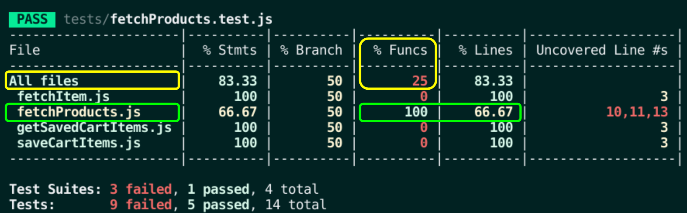

# Boas vindas ao repositório do projeto de Carrinho de Compras!

## Habilidades

Nesse projeto, precisei:

- Fazer requisições a uma API _(Application Programming Interface)_ do Mercado Livre;
- Utilizar os meus conhecimentos sobre JavaScript, CSS e HTML puros;
- Trabalhar com funções assíncronas;
- Implementar testes unitários.

---

## O que foi desenvolvido

Nesse projeto foi feito um **carrinho de compras** totalmente dinâmico! E o melhor: consumindo dados diretamente de uma **API!**. Aqui usaremos a API do Mercado Livre para buscarmos produtos à venda.

### ESLint e Stylelint

Para garantir a qualidade do código, vamos utilizar neste projeto os linters `ESLint` e `Stylelint`.
Assim o código estará alinhado com as boas práticas de desenvolvimento, sendo mais legível
e de fácil manutenção! Para rodá-los localmente no projeto, execute os comandos abaixo:

```bash
  npm run lint
  npm run lint:styles
```

### Cobertura de testes

Neste projeto, foram implementados testes para quatro funções.

Essa cobertura avalia a eficácia dos testes implementados de acordo com os requisitos, determinando se cobrem o que foi pedido ou não.

**Será testado apenas as quatros funções pedidas, e não toda a aplicação!**

Para executar e acompanhar a implementação da sua cobertura de testes, rode o comando abaixo:

```bash
npm run test:coverage
```

Ao realizar o comando terá um resultado similar a este:



Os destaques em amarelo fazem referência à cobertura total e os em verde demonstram a função do requisito desejado.

## API Shopping Cart

O [manual da API do Mercado Livre](https://developers.mercadolivre.com.br/pt_br/itens-e-buscas) contém muitas informações sobre ela. Utilizaremos alguns dos _endpoints_.
